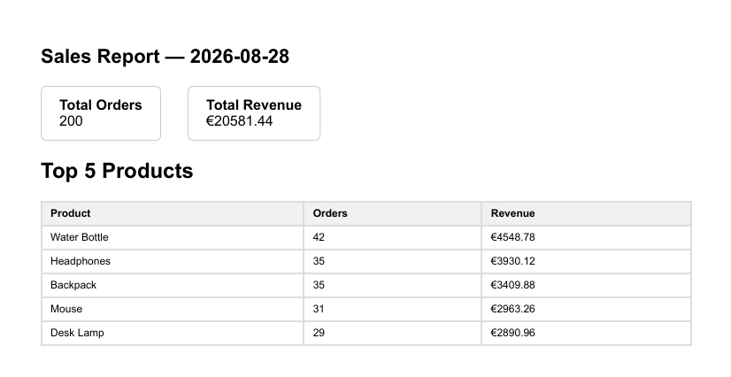

# 📊 PDF Report Generator

**FlyRank AI Internship — Backend Engineering Track**
**Assignment A8 · Week 4 · "Query, Render, Store"**

A lightweight backend service that turns raw sales data into a polished, downloadable PDF report — on demand, via a single API call. Built to demonstrate the four core skills of a production reporting pipeline: **SQL aggregation**, **server-side rendering**, **artifact storage**, and **idempotent job handling**.

---

## ✨ What it does

| Stage | Capability |
|---|---|
| 🗄️ **Data** | Seeds a SQLite database with ~200 realistic sales orders |
| 📐 **Aggregation** | Runs SQL to compute totals, top products, and daily trends |
| 🖨️ **Render** | Converts the report into a real PDF using a headless browser |
| 📦 **Serve** | Stores the file and exposes it through a clean REST API |
| 🔁 **Idempotent** | Re-requesting the same day's report reuses the existing file — no duplicates |

**Dataset:** Option A — *the little shop* (`orders` table, ~200 seeded rows)

---

## 🚀 Quick Start

```bash
# 1. Install dependencies
pip install -r requirements.txt
playwright install chromium

# 2. Seed the database (safe to run more than once — clears then re-inserts)
python seed.py

# 3. Start the API
uvicorn main:app --reload

# 4. Try it
curl http://localhost:8000/health
curl -X POST http://localhost:8000/reports
curl -o my-report.pdf http://localhost:8000/reports/1/file
```

---

## 🔍 Aggregation SQL

```sql
-- Total orders
SELECT COUNT(*) FROM orders;

-- Total revenue
SELECT SUM(amount) FROM orders;

-- Top 5 products by revenue
SELECT product, SUM(amount) AS revenue, COUNT(*) AS orders_count
FROM orders
GROUP BY product
ORDER BY revenue DESC
LIMIT 5;

-- Orders per day, last 7 days
SELECT created_at AS day, COUNT(*) AS orders_count
FROM orders
WHERE created_at >= date('now', '-6 days')
GROUP BY created_at
ORDER BY created_at;
```

---

## 🔌 API Reference

| Method | Endpoint | Description | Response |
|---|---|---|---|
| `GET` | `/health` | Liveness check | `200` |
| `POST` | `/reports` | Generate (or reuse) today's report | `201` new · `200` reused |
| `GET` | `/reports/:id` | Fetch report metadata | `200` / `404` |
| `GET` | `/reports/:id/file` | Download the PDF | `200`, `application/pdf` |

**Example flow:**

```
POST /reports          → 201 {"id": 1, "file": "/reports/1/file"}
GET  /reports/1        → 200 {"id": 1, "created_at": "...", "file": "/reports/1/file"}
GET  /reports/1/file   → 200 application/pdf  (downloads the actual report)
```

---

## 🖼️ Sample Output



*Page 1 of a generated report — total orders, total revenue, and a top-5 product breakdown, all computed live from the seeded dataset.*

---

## 🧠 Design Notes

### Why the pipeline runs synchronously *(Stage 4)*

`POST /reports` currently runs the full pipeline — query, render, save — inside the request itself, so the response takes a few seconds. For a single user this is perfectly fine.

If report generation grew heavier (larger datasets, many concurrent users), the natural next step is the **background-job pattern**: return `202 Accepted` immediately with an `id`, run the pipeline in a worker process, and let the client poll `GET /reports/:id` for a `pending` → `done` status.

### Why idempotency matters *(Stage 5)*

The duplicate-request check exists to protect against a user double-clicking "Generate Report" and accidentally creating multiple files for the same day — wasted storage and a confusing history.

> A familiar real-world parallel: an e-commerce checkout without this kind of guard can charge a customer's card twice if "Pay Now" is double-clicked.

### Proof of idempotency

Two rapid `POST /reports` calls on the same day return the **same `id`** — the second responds `200` with `reused: true`, and exactly **one** new file appears in `reports/`. Passing `{"force": true}` bypasses the check and creates a genuinely new report.

---

## 🛠️ Tech Stack

`Python` · `FastAPI` · `SQLite` · `Playwright (Chromium)` · `Uvicorn`

---

## 📁 Project Structure

```
pdf-report-generator/
├── main.py             # API endpoints
├── db.py                # SQLite connection + schema
├── seed.py               # Fake data generator
├── report.py              # SQL aggregation + HTML → PDF rendering
├── requirements.txt
├── screenshots/
│   └── report-preview.png
└── reports/                # Generated PDFs (git-ignored)
```
